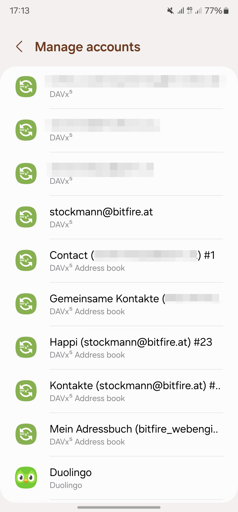

========================
Accounts and Collections
========================

What is a DAVx⁵ account?
========================

A DAVx⁵ account represents a connection to a CalDAV/CardDAV service, which can contain address books, calendars and task lists. Most services provide both CalDAV and CardDAV together (technically, this is when both CalDAV and CardDAV can be detected from the same starting point). In this case, you need only one DAVx⁵ account. However, you can also create multiple DAVx⁵ accounts for separate CalDAV/CardDAV services.

Contacts, events and tasks must be saved to a DAVx⁵ account so that DAVx⁵ can synchronize them. **DAVx⁵ will not synchronize or otherwise touch entries that belong to other accounts (like Google or device-local accounts).**

When you add a DAVx⁵ account, you need either an email address or a base URL as the starting point for service discovery. You can find the required base URL in your server manual or ask your IT department. See our `tested services <https://www.davx5.com/tested-with/>`_ for a list of servers/services and how they're used with DAVx⁵.

How does service discovery work?
================================

DAVx⁵ supports both `service location discovery by SRV/TXT records <https://tools.ietf.org/html/rfc6764>`_ and
`well-known URLs <https://tools.ietf.org/html/rfc5785>`_. To use CalDAV and CardDAV in one DAVx⁵ account, provide these redirects on your server:

``/.well-known/caldav`` → CalDAV service path (302 Found), like ``/remote.php/caldav/``
``/.well-known/carddav`` → CardDAV service path (302 Found), like ``/remote.php/carddav/``

If these redirects are configured correctly, you can use the root URL ``http(s)://your.server.example/``
without any additional paths as the base URL in DAVx⁵.

What is the Base URL?
=====================

When logging in by URL, DAVx⁵ asks for the *Base URL*. This can be:

* the root URL (/) of your server if well-known URLs are configured (recommended), or
* a valid CalDAV URL, i.e.

  - a URL that provides a CalDAV ``current-user-principal``, or
  - a URL that provides ``calendar-home-set``, or
  - a calendar URL (``resourcetype: calendar``), and/or

* a valid CardDAV URL, i.e.

  - a URL that provides a CardDAV ``current-user-principal``, or
  - a URL that provides ``addressbook-home-set``, or
  - an addressbook URL (``resourcetype: addressbook``).

So, DAVx⁵ will query the base URL for both CalDAV and CardDAV and use whatever it finds. If CalDAV and CardDAV are separated on your server and well-known URLs are not configured, you'll have to create two DAVx⁵ accounts: one for CalDAV (use the CalDAV URL as base URL) and one for CardDAV (use the CardDAV URL as base URL).

If the URL is entered without scheme, ``https://`` will be prepended. `Use of CalDAV/CardDAV over plain HTTP is not recommended for security reasons. <https://tools.ietf.org/html/rfc6352#section-13>`_

Address book accounts
=====================

In Android, contacts are assigned directly to accounts, without the possibility of having multiple address books (in contrast to events and tasks, where calendars and task lists are available as grouping entities).

So, DAVx⁵ defines a new account type "DAVx⁵ address book" beside the regular DAVx⁵ account type in order to provide support for multiple address books with one regular DAVx⁵ account.
**The address book account names will be shown in your Contacts app as possible destinations for contacts.**

   Android Settings / Accounts with configured DAVx5 account

For every synchronized CardDAV address book, a DAVx⁵ address book account is created automatically. When synchronizing "address books" of the main DAVx⁵ account, DAVx⁵ starts synchronizing contacts for every DAVx⁵ address book account.

.. warning::
   Do not create, modify or delete DAVx⁵ address book accounts directly. Use the DAVx⁵ app to configure synchronized address books instead.

DAVx⁵ address books accounts are named after the CardDAV address book which they are connected to, plus a hash of the URL, for instance: *My addresses (UA)*
(in this case, the hash is *UA*). The hash is necessary when there are two address books with the same name.

Account names
=============

When setting up a DAVx⁵ account, you will be asked for the account name. This account name (which
will be shown in the DAVx⁵ accounts list and in Android Settings / Accounts / DAVx⁵) is used as
email address for scheduling (when events have attendees), so:

.. note:: If you're using CalDAV with an account, always use your email address as account name.

During initial resource detection, DAVx⁵ queries the ``calendar-user-address-set`` of the CalDAV
principal URL and suggests found email addresses as account name.

Some devices have problems when there's an apostrophe (``'``) in the account name. We suggest to avoid
apostrophes in account names.

The account name must be unique, i.e. you can't have two DAVx⁵ accounts with the same account name.
This is important if you need separate accounts for CalDAV and CardDAV. In this case, use
your email address as account name for the CalDAV account and another account name
(like "My CardDAV Server") for the CardDAV account.

Service tabs
============

If you open a DAVx⁵ account, you can see up to three tabs:

1. CardDAV – lists your address books
2. CalDAV – your calendars and task lists are there
3. Webcal – subscribed calendars (Webcal) which have been provided over CalDAV

Only available services (= those which have been detected during account setup)
will be shown. For instance, if you have added a CardDAV-only service (like
a Webmail service that doesn't have calendars), only the CardDAV tab will show up.

When synchronization is active, it's indicated by a progress bar on top of the tab. For instance,
if contacts are currently being synchronized, there will be an animated progress bar at the top of
the CardDAV tab. Pending synchronizations are indicated by a semi-transparent, non-animated progress
bar.

**To enable synchronization of a collection (address book/calendar/task list), select the checkmark of
the respective entry.** Collection-specific actions (like viewing the collection properties or deleting the collection
from the server) are accessible over the action overflow (⋮) next to the entry.

Immediate synchronization of the whole account can be forced using the "Synchronization" floating
action button (🗘).

Actions which affect the whole account or more than one collection (like locally deleting the account
from the device or refreshing the collection list) are accessible over the action menu of the whole account view.

.. _refresh-collections:

Refreshing the collection list
==============================

**To detect new and changed address books/calendars, you have to refresh the collection list.** To do so, open an account in DAVx⁵, select a tab (for instance, CardDAV when you want to refresh address books) and then either swipe down or use the respective action menu (⋮) entry. When you refresh the collection list, DAVx⁵ will search the home sets for new collections and check the already known collections (whether they are still there and whether properties like name and color have been changed). These functions will only be available if a principal and/or homeset URL can be found for the respective protocol.

The collections and their properties (name, color, read-only) are not synchronized to the Android system immediately, but as soon as synchronization is triggered.

For example, if a calendar's name and color have been changed on the server:

* Open the respective account in DAVx⁵ and select the CalDAV tab.
* Swipe down or choose "Refresh calendar list" in the action menu (⋮). Now the new name and color will appear in the DAVx⁵ account, but not yet in the calendar app (because there was no synchronization yet).
* As soon as synchronization is started, the changed properties (name, color) are commited to the Android calendar provider. Calendar apps will now show the new name and color.

Read-only collections
=====================

There are two ways to restrict synchronization to one direction (only server to Android):

#. DAVx⁵ follows the WebDAV permissions from the server. If you don't have write permissions for a specific collection, it will be treated as read-only.
#. If you have write permissions for a specific collection, you can force read-only mode ("one-way sync") for this collection using the action overflow (⋮). You have to synchronize a collection before forced read-only takes effect. This is a convenience feature (for instance, for home usage) and doesn't provide security. Any other CalDAV/CardDAV client could still modify the resources. If you need real security, restrict access on the server side with WebDAV ACL.

Regardless of why a collection is read-only, it will be shown as read-only (⛔) in the DAVx⁵ collection list.

.. note:: Android doesn't have native support for read-only address books. To emulate this feature, DAVx⁵ reverts local changes at every synchronization. You can still edit a contact in the Contacts app, but the changes will be reverted when this contact is synchronized from the server (at the latest when it's changed on the server).

Read-only calendars will be marked as read-only in the Android calendar provider, so that calendar apps won't be able to create/modify/delete events in such calendars anymore. Currently, there's no read-only support for task lists.

Creating/deleting collections on/from the server
================================================

You can also manage collections with DAVx⁵.

To create a collection, select the CalDAV or CardDAV tab in the DAVx⁵ account and then use the respective action menu (⋮) entry. For instance, choose "Create new address book" next to "CardDAV" to create a new address book on the server. (This will only work if it's supported by the server, which is not mandatory.) The same applies to calendars and task lists.

To delete a collection, choose "Delete collection" from the action overflow (⋮) of the respective collection in the DAVx⁵ account. After your confirmation, this will delete the collection and all its entries on the server, so be careful.

Webcal integration
==================

DAVx⁵ recognizes Webcal calendars in the calendar home set which are published with
``resourcetype: subscribed`` and shows them in the DAVx⁵ account activity. If you select such a Webcal collection for synchronization, DAVx⁵ passes
the URL to an installed Webcal-capable app like `ICSx⁵ <https://icsx5.bitfire.at>`_ so that this app can subscribe to the calendar.

If you're using ICSx⁵, DAVx⁵ can determine whether a Webcal collection is currently subscribed and can also remove the subscription again.

