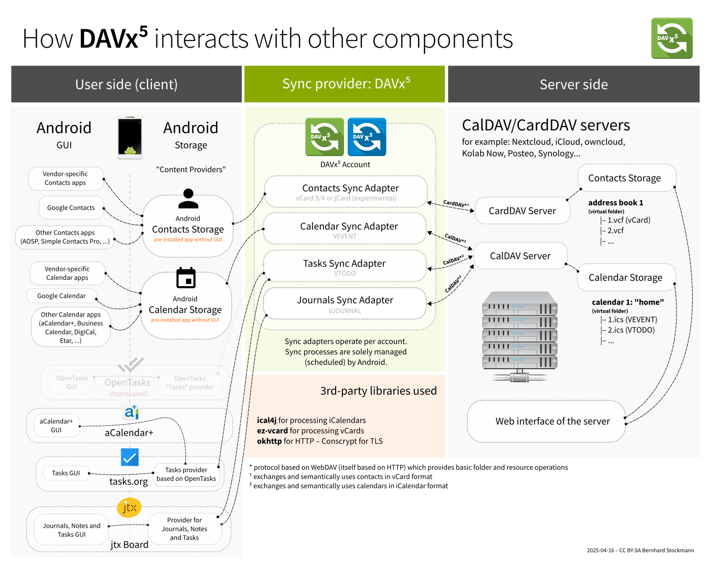

============
Introduction
============

What is DAVx⁵?
==============

DAVx⁵ is a :term:`CalDAV`/:term:`CardDAV` client (management and sync app) for Android. It allows you to

* manage CalDAV/CardDAV collections (address books, calendars, task lists) on your server and
* synchronize them with your Android device (to be specifically, with the storage backends of the device, see illustration below).

DAVx⁵ is not:

* a storage backend – This means that your contacts, events and tasks will not be stored within the DAVx⁵ app but in the respective content providers.
* a contacts, calendar or tasks app – You still need separate apps to view and edit your contacts, events and tasks. You can use any app that uses the Android Contacts/Calendar Provider for contacts/calendars and an OpenTasks provider for tasks.
* a backup tool – You can use DAVx⁵ to transfer your data to a server, but **make sure to perform server backups on a regular basis.**
  Just imagine that an app you have installed deletes all contacts on your phone: DAVx⁵ will synchronize these deletions as expected and all contacts will be gone on the server, too.

   DAVx⁵ is the interface between the local storage (which is used by the end-user apps) and the CalDAV/CardDAV service.

First steps
===========

How to start using DAVx⁵ on your Android device:

#. Download and install DAVx⁵ and, if you want to synchronize tasks, OpenTasks.
#. Open DAVx⁵.
#. Allow it to be whitelisted from battery saving.
#. Tap on ⊕ to create a new account.
#. Enter your base URL / email address and login credentials.
   You can get the base URL from your service provider and/or our `list of tested services </tested-with>`_.
#. Finish the steps to create the account.
#. Select the account in DAVx⁵.
#. Select the address books and calendars/task lists you want to have synchronized so that they are shown with checkmark (☑). Grant contact, event and task access permissions when asked.
#. You can now access your address books, events and tasks using the respective apps (Contacts, Calendar, S Planner, OpenTasks etc.) on your device.

When you create a contact/event, select the desired DAVx⁵ account as storage location.
Local contacts/events will stay on your phone and not be synchronized. If you're using DAVx⁵ the first time, you may
want to :faq:`transfer your local contacts to the CardDAV server <existing-contacts-are-not-synced>`.

On some devices (like Xiaomi), :faq:`additional steps are required to allow DAVx⁵ to run
automatically <synchronization-is-not-run-as-expected>`.

Permissions and battery optimization
====================================

DAVx⁵ requires various Android permissions in order to perform its task.
It will ask for contacts, events and task access permissions.

DAVx⁵ will also ask about being whitelisted from battery saving.
Since Android 6, Android has two features called *doze* and *app standby* which reduce battery usage
by restricting apps which are not interactively used at the moment. This will also
disable synchronization for apps unless they're actively used or the device is
connected to a power supply.

.. note:: 
   If you want DAVx⁵ synchronization to be run in regular intervals in the background, DAVx⁵ must be exempt from "battery saving"! This does not mean that DAVx⁵ requires more battery than it should, but only that you allow DAVx⁵ to run in the background for synchronization.

Some devices (e.g. Huawei) also have an autostart permission, which must be granted for DAVx⁵ to work.
See the :faq:`FAQ entry about automatic synchronization for more information <synchronization-is-not-run-as-expected>`.

Glossary
========

Some important terms to better understand how DAVx⁵ works:

.. glossary::

   WebDAV 
      HTTP-based protocol to manage remote resources (≙ files/directories) and collections (≙ directories). WebDAV collections may contain member resources. Provides methods to list, upload, modify, delete resources and their metadata; locking, access permissions (ACL) etc.

   CalDAV
      Extension for WebDAV to process events (VEVENT) and tasks (VTODO) in iCalendar format. CalDAV servers semantically understand and process entries and can – for instance – filter events so that only events within a certain time range are delivered.

   CalDAV Scheduling
      An extension for CalDAV for performing scheduling operations like inviting other people to events, managing attendees and their participation status etc.

   Calendar provider
      On Android devices, there is a database where calendars/events are stored. This database belongs to a system app called
      `Calendar provider <https://developer.android.com/guide/topics/providers/calendar-provider>`_. To access the calendars
      and events, apps communicate with the Calendar provider.

   CardDAV
      Extension for WebDAV to process contacts in vCard format. CardDAV servers semantically understand and process entries.

   Collection
      A folder where iCalendar/vCard resources are stored. In CalDAV, collections are calendars/task lists; in CardDAV, they're address books.

   Contacts provider
      On Android devices, there is a database where contacts are stored. This database belongs to a system app called
      `Contacts provider <https://developer.android.com/guide/topics/providers/contacts-provider>`_. To access the contacts,
      apps communicate with the Contacts provider.

   iCalendar
      File format to exchange events, tasks, journal entries and busy-time information. Cares about time zones, date/time formats, recurring events and exceptions etc. DAVx⁵ maps Android events and tasks to iCalendar resources and vice versa. Every event/task is stored as a separate iCalendar resource (".ics file") on the server.

   vCard
      The "electronic business card" is a file format to exchange contact and contact group information. CardDAV servers are required to support at least vCard 3, but for some advanced features, vCard 4 is needed. DAVx⁵ maps Android contacts and contact groups to vCard resources and vice versa. Every contact is stored as a separate vCard resource (".vcf file") on the server.

