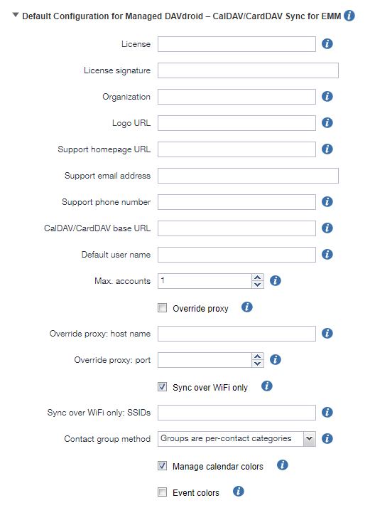

=============
Managed DAVx⁵
=============

Managed DAVx⁵ is a version of DAVx⁵ that contains mass-deployment and configuration features
for organizations.

Managed configuration
=====================

Managed DAVx⁵ allows you to manage DAVx⁵ clients centrally by using these configuration methods (in order of precedence):

* Android Enterprise (recommended)
* network configuration: fixed URL (QR code)

This configuration is used in the Managed DAVx⁵ UI and for new Managed DAVx⁵ accounts.

.. note:: Existing Managed DAVx⁵ accounts on your devices won't be modified when the managed configuration is changed.

Configuration by Android Enterprise
===================================

Android Enterprise is the recommended method to configure Managed DAVx⁵. With Android Enterprise, IT departments can deploy apps to
**managed devices** and configure them in a standardized way using MDM software. Apps are configured by **managed configurations**
(sometimes called restrictions) which can be set in the MDM software for every deployed app.

   You can configure Managed DAVx⁵ using MDM/EMM software.

Network configuration
=====================

Network configuration requires your Android devices to be connected to the network where the configuration file can be found.

Configuration by fixed URL
--------------------------

The simplest method to configure Managed DAVx⁵ over the network is to use a fixed configuration file URL, which can for example be provided as a QR code. This method can be used if you don't want to use automatic discovery of the Managed DAVx⁵ configuration file:

#. **Upload the Managed DAVx⁵ configuration file to a HTTPS server** in the network (file name: ``davdroid-config.json``)
#. Managed DAVx⁵ / Managed configuration / Scan the QR code of the configuration file URL or enter the URL.

Certificates
------------

When accessing the configuration file, PKI is used to verify the TLS certificate, so a self-signed certificate won't work without adding it to the Android device first. We recommend to put the configuration file to a location which is accessible over a trusted certificate. You can then define custom trusted certificates in the configuration file.

Caching
-------

Two types of caching are used to cache Managed DAVx⁵ configuration when it's taken from the network:

#. configuration cache and
#. HTTP cache.

Configuration cache:
   Managed DAVx⁵ caches the configuration file which is fetched from the network so that Managed DAVx⁵ configuration is available when there is no network access (and for the time when Managed DAVx⁵ has been started, but the new network configuration is not ready yet). The cache will be overwritten when a new configuration file is downloaded. To reset the cache without a new configuration file, use: Managed DAVx⁵ / About/License / Managed configuration / Reload configuration.

HTTP cache:
   The configuration file is cached when it has been downloaded from the network according to the rules of the HTTP protocol. For instance, if the Web server which hosts the configuration file returns a freshness period of one hour, Managed DAVx⁵ will always use the cached version for one hour. However, the configuration file will be downloaded at least once a day (``max-age: 1 day``) to avoid problems caused by obsolete configuration files. If there is no ``Expires``, the cache will use ``If-Match`` and ``If-Unmodified-Since``.

It's advisable to set an expiration time for the configuration file on the Web server (for instance, one hour) explicitly to avoid unnecessary network traffic every time Managed DAVx⁵ is started on a device.

Configuration variables
=======================

These variables can be used for Managed DAVx⁵ configuration:

:Name: license
:Type: text
:Required: yes
:Description: license data (JSON without surrounding curly brackets)
..
:Name: license_signature
:Type: text
:Required: yes
:Description: license signature (Base64)
..
:Name: organization
:Type: text
:Required: no
:Description: organization display name; shown in app drawer and login activity
..
:Name: logo_url
:Type: text (URL)
:Required: no
:Description: organization logo; shown in login activity; must be publicly accessible without authentication
..
:Name: support_homepage_url
:Type: text (URL)
:Required: no
:Description: URL of intranet page with details on how to use Managed DAVx⁵ in this organization and how to get internal support; shown in app drawer
..
:Name: support_email_address
:Type: text (email address)
:Required: no
:Description: internal support email address – shown in app drawer and some notifications
..
:Name: support_phone_number
:Type: text (phone number)
:Required: no
:Description: internal support phone number – shown in app drawer and some notifications
..
:Name: login_introduction
:Type: text (simple HTML)
:Required: no
:Description: message that will be shown when the user adds an account; may contain simple HTML like paragrahps, bold text and links
..
:Name: login_base_url
:Type: text (URL)
:Required: yes
:Description: base URL for CalDAV/CardDAV service discovery when an account is added; example: ``https://server.example.com/dav/``
..
:Name: login_type
:Type: text
:Required: no
:Default: DEFAULT
:Description:
 ``DEFAULT`` = login with username/password/certificate |br|
 ``NEXTCLOUD_LOGIN_FLOW`` = Nextcloud login flow
..
:Name: login_user_name
:Type: text
:Required: no
:Description: pre-filled user name when an account is added
..
:Name: login_password
:Type: text
:Required: no
:Description: pre-filled password when an account is added; see security note below
.. warning::
   Using ``login_password`` is only recommended with app-specific per-user passwords. Keep in mind that the user
   may be able to retrieve the password even if ``login_credentials_lock`` is set.
..
:Name: login_credentials_lock
:Type: integer
:Required: no
:Default: 0
:Description: whether credentials can be changed by user. |br|
 0 = don't lock (user can change credentials) |br|
 1 = lock at login (user can still change credentials in account settings) |br|
 2 = lock at login and in account settings (user can't change credentials)
.. Note:: ``login_credentials_lock`` replaces ``login_lock_credentials``. See :ref:`Deprecated Variables<Deprecated variables>`.
..
:Name: login_certificate_alias
:Type: text
:Required: no
:Description: if provided, client certificates will be used for authentication (instead of user name/password); value of this field will be pre-selected (if available)
..
:Name: login_certificate_and_password
:Type: boolean
:Required: no
:Description: whether login should use both certificate AND username + password
..
:Name: preselect_collections
:Type: integer
:Required: no
:Default: 0
:Description: whether collections are automatically selected for synchronization after their initial detection |br|
 0 = none (don't preselect) |br|
 1 = all (preselect if not excluded) |br|
 2 = :ref:`personal<Personal collections>`. (preselect if personal and not excluded)
..
:Name: preselect_collections_excluded
:Type: text (regular expression)
:Required: no
:Description: regular expression whose matches with collection URLs will be excluded from preselection; |br|
 example: ``/z-app-generated--contactsinteraction--recent/`` (Nextcloud's "Recently Contacted" addressbook; the slashes are URL path separators and not regex syntax elements)
..
:Name: force_read_only_addressbooks
:Type:  boolean
:Required: no
:Default: false
:Description:
 *true* = DAVx⁵ will set all address books to read-only. This will only prevent *client side* editing of contacts from DAVx⁵. If any changes are made they will be reverted to the version present on the server. Keep in mind that this is not preventing changes to the address book in general. For instance other apps can still change the address book on the server. |br|
 *false* = DAVx⁵ won't change standard read-only setting.
..
:Name: max_accounts
:Type: integer
:Required: no
:Description: maximum number of accounts – no new accounts can be added when this number of accounts is reached
..
:Name: proxy_type
:Type: integer
:Required: no
:Default: -1
:Description: Sets the proxy type for all HTTP(S) connections. Uses ``override_proxy_host`` and ``override_proxy_port``, if applicable. |br|
 -1 = system default |br|
 0 = none |br|
 1 = HTTP |br|
 2 = SOCKS
..
:Name: override_proxy_host
:Type: text (host name)
:Required: no
:Description: HTTP proxy host name
..
:Name: override_proxy_port
:Type: integer (port number)
:Required: no
:Description: HTTP proxy port number
..
:Name: default_sync_interval
:Type: integer (number of seconds)
:Required: no
:Default: 14400 seconds (4 hours)
:Description: initial sync interval at account creation (contacts/calendars/tasks); default value: 14400 seconds (4 hours). Only these values are eligible: 900 (15 min), 1800 (30 min), 3600 (1 h), 7200 (2 h), 14400 (4 h), 86400 (1 day). |br|
 Can always be overwritten by users. Changing this value will only affect newly added accounts.
..
:Name: wifi_only
:Type: boolean
:Required: no
:Default: *false*
:Description: *true* = DAVx⁵ will only sync when a WiFi connection is active (doesn't apply to manually forced synchronization) |br|
 *false* = DAVx⁵ will sync regardless of the connection type
..
:Name: wifi_only_ssids
:Type: text (comma-separated list)
:Required: no
:Description: when set, DAVx⁵ will only sync when device is connected to one of these WiFis; only used when wifi_only is true;  |br|
 example: ``wifi1,wifi2,wifi3``
..
:Name: contact_group_method
:Type: text
:Required: no
:Default: ``GROUP_VCARDS``
:Description: ``CATEGORIES`` = contact groups are stored as per-contact category tags |br|
 ``GROUP_VCARDS`` = contact groups are separate VCards
..
:Name: manage_calendar_colors
:Type: boolean
:Required: no
:Default: *false*
:Description: *true* = DAVx⁵ will overwrite local calendar colors with the server colors at every sync |br|
 *false* = DAVx⁵ won't change local calendar colors at every sync
..
:Name: event_colors
:Type: boolean
:Required: no
:Default: *false*
:Description: *true* = DAVx⁵ will synchronize event colors |br|
 *false* = DAVx⁵ won't synchronize event colors |br|
 Setting to *true* causes some default calendar apps to crash → make sure that your preferred calendar app is working with this setting
..
:Name: default_alarm
:Type: integer (number of minutes)
:Required: no
:Default: -1
:Description: number of minutes a default reminder will be created before the start of every non-full-day event without reminder; no value (null) or value -1: no default reminders |br|
 Can always be overwritten by users. Changing this value will only affect newly downloaded events.
..
:Name: show_only_personal
:Type: integer
:Required: no
:Default: -1
:Description: -1 = user can choose |br|
 0 = show all collections |br|
 1 = show only collections in the user's own home-sets

Deprecated variables
====================
Please stop using the following variables and use the new ones instead.

:Name: login_lock_credentials (**Deprecated**. Use ``login_credentials_lock`` instead.)
:Type: boolean
:Required: no
:Default: false
:Description: whether user name and password are locked (= can't be edited by the user) in case they are provided by managed configuration.

Configuration file syntax
=========================

For the network or local file configuration method, a Managed DAVx⁵ configuration file is required.
It contains configuration variables in JSON format, like this:

.. code-block:: json

   {
     "license": "<escaped JSON, don't change this>",
     "license_signature": "<don't change this>",
     "organization": "bitfire",
     "logo_url": "https://intranet.example.com/your-logo.png",
     "support_homepage_url": "https://intranet.example.com/how-to-use-davdroid",
     "support_email_address": "it-support@example.com",
     "support_phone_number": "+1 234 56789",
     "login_base_url": "https://caldav+carddav.example.com/",
     "max_accounts": 1,
     "override_proxy": false,
     "wifi_only": true,
     "wifi_only_ssids": "wifi1,wifi2",
     "contact_group_method": "GROUP_VCARDS",
     "manage_calendar_colors": true,
     "default_sync_interval": 3600,
     "event_colors": false
   }
