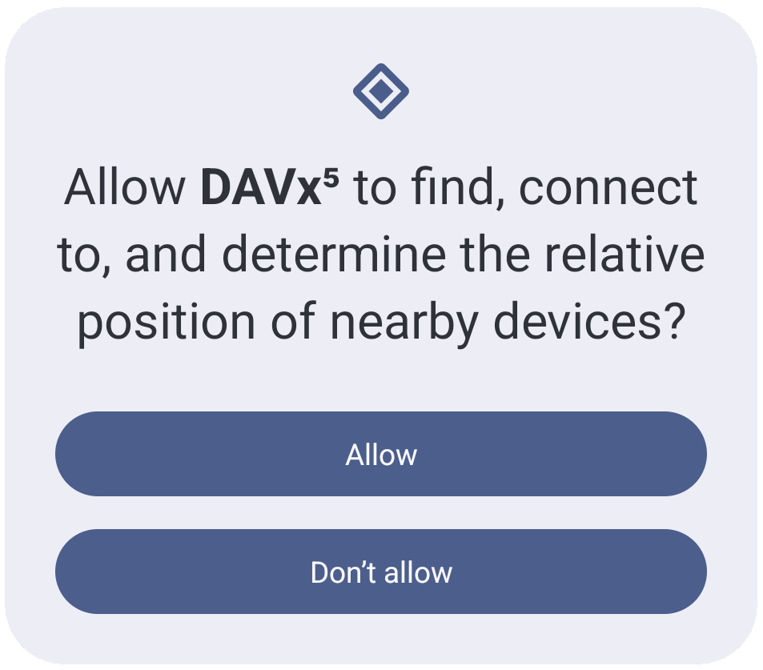

===========
Permissions
===========

Local Network Access
====================

Since Android 17, the system requires a new permission for accessing devices in the local network.

Depending on the device manufacturer this may be shown as "find nearby devices", the same dialog as for other "Nearby Devices" permissions.

If you access your server through a local IP address (example: `192.168.1.20`), you may want to grant this permission.
This does not apply when using a VPN.

More information:
    `Android Developers: Local network definition <https://developer.android.com/privacy-and-security/local-network-definition>`_
    
    `Android Developers: Local network permission <https://developer.android.com/privacy-and-security/local-network-permission>`_
