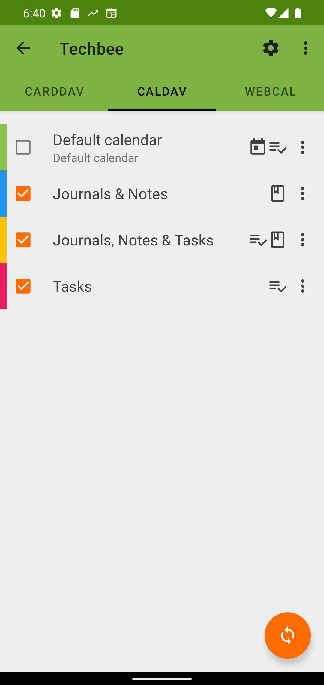

========================
Tasks / Notes / Journals
========================

Introduction
============

With DAVx⁵ – besides calendar entries (VEVENT) and contacts (vCard) – you can sync

- tasks (VTODO) with compatible apps
  (`jtx Board <https://jtx.techbee.at/>`_, `OpenTasks <https://opentasks.app/>`_, `Tasks.org <https://tasks.org/>`_) and
- journals and notes (VJOURNAL) with jtx Board.

This section provides more information about synchronizing tasks, notes and journals with jtx Board. Integration with the other apps work similarly.

Setting up the integration
==========================

1. Install the desired tasks/notes app.
2. Allow DAVx⁵ to access the tasks/notes app (DAVx⁵ will ask for the permissions; or use *DAVx⁵ / Settings / App permissions*).
3. In *DAVx⁵ / Settings / Tasks app*, you can select up to one tasks app that will be used for synchronization.

Journals, Notes
===============

VJOURNALs are entries that can have a start date but do not occupy space in a calendar. jtx Board uses the VJOURNAL component as defined in the iCalendar format to store and provide journals and notes for synchronization. Journals are stored with a start date whereas notes have no date assigned. 

In order to synchronize VJOURNALs the CalDAV-server that should be used for synchronization must support the VJOURNAL component of the iCalendar format. Some servers support VJOURNALs without problems, whereas others cause issues. This might be due to the scarce usage of the VJOURNAL component. Please consider reaching out to your server-provider if you encounter any issues that could be due to an unsufficient support for the VJOURNAL component. Our compatibility list will be updated on a regular basis. 

If your CalDAV-server supports VJOURNAL, make sure that you have either an existing collection with VJOURNAL support: 

or create a new collection for an account with VJOURNAL support enabled: 

.. figure:: images/davx5_add_journal_collection.png
   :alt: Screenshot of DAVx⁵ with the screen to add a new collection with Journal support
   :target: _images/davx5_add_journal_collection.png
   :width: 250
   
Once you have a collection with VJOURNAL support, make sure that it is activated for syncrhonization. Just start the sync and the collection will appear in the jtx Board app. You can doublecheck if everything worked correctly in the jtx Board app by clicking on *Sync with DAVx⁵* in the main menu – the compatible collections will appear. Now you can make new Journals and Notes and store them in your collection in order to synchronize them with the server. 

Tasks
=====

VTODOs are entities that can have a start, due and completed date as well as a progress assigned (amongst others). jtx Board uses the VTODO component as defined in the iCalandar format to store and provide tasks for synchronization. As for VJOURNALs your server must support the VTODO component in order to use it for synchronization. The VTODO component is a well-established component in the iCalendar format and many servers support it. However, the same conditions as for VJOURNALs apply: Make sure that your server supports VTODOs and that you have at least one collection activated for synchronization that supports VTODOs or create a new collection for an account with VTODO support enabled:

Combining Journals, Notes & Tasks
=================================

If you would like to combine entries for example by using Notes as comments to Tasks or by adding Subtasks to Notes and Journals, make sure that you are working in a collection with VJOURNAL AND VTODO enabled. 

